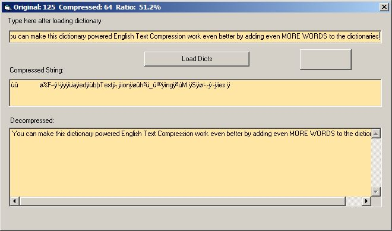



## Dictionary\-Based english Text Compression

### Description

*Now about 50% faster compress performance, fixed some glitches and improved compression ratio.

*UPDATED: Now supports both upper and lower case words (any sentence should come out fine regardless of case, etc.) + Some performance and compression optimizations.

SEE COMMENTS AT TOP OF COMPRESSION MODULE FOR FULL DETAILS.

This code basically takes a string composed of everyday conversational english, and compresses it to a much smaller string using a set of dictionaries (included), and can also decompress any previously compressed strings..

This code was designed to be applied in a chat environment to save server bandwidth as the server has to echo many messages to hundreds of users many times per minute, this can make a big difference in bandwidth usage and in the case of a mmo game server, can help to ensure smoother gameplay as the game grows. Compared to zlib this is much more efficient at english-language compression, but entirely not suitable for other types of strings that do not contain english words.

This code is intended to be used on the client side, and only includes the procedures necessary to compress and decompress a string, specifically everyday English conversational sentences.
 
### More Info
 

             |
---                |---
**Submitted On**   |2010-07-31 12:35:30
**By**             |[\(Tim Miron\) yar\-interactive software](https://github.com/Planet-Source-Code/PSCIndex/blob/master/ByAuthor/tim-miron-yar-interactive-software.md)
**Level**          |Intermediate
**User Rating**    |5.0 (15 globes from 3 users)
**Compatibility**  |VB 5\.0, VB 6\.0
**Category**       |[String Manipulation](https://github.com/Planet-Source-Code/PSCIndex/blob/master/ByCategory/string-manipulation__1-5.md)
**World**          |[Visual Basic](https://github.com/Planet-Source-Code/PSCIndex/blob/master/ByWorld/visual-basic.md)
**Archive File**   |[Dictionary2185547312010\.zip](https://github.com/Planet-Source-Code/tim-miron-yar-interactive-software-dictionary-based-english-text-compression__1-70444/archive/master.zip)

